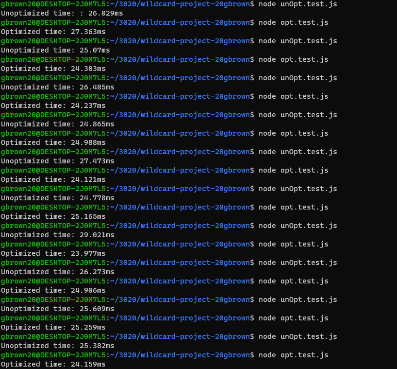

# Wildcard Project

## Dijkstra's Algorithm Optimization

I wanted to optimize my previous implementation for Dijkstra's algorithm by adding a priority queue (min-heap). I did this by using a data strucuture that could extract the minimum element. The code in opt.js shows how I used a binary heap for the priority queue. Out of 10 times that each test was ran, it can be seen that the optimized version ran faster 7/10 times. There could be variables such as my machine, that caused some run times to be slower for the optimized version.

The code in unOpt.js is my old implementation.

## Runtime Comparison

It was found from my old implementation that the run time for worst case and best case is $O(V^2)$. This was due to iterating over all vertices to find the minimum distance and performing relaxation for all neighbors for a given vertex.

In the new optimized version the priority queue allows me to extract the minimum element efficiently. which reduces the time complexity of finding the minimum distance vectex. With the priority queue, the time complexity of each extraction and relaxation operation becomes $O(log V)$. This makes the overall complexity $O((V + E) log V)$, leading to a more efficient, optimized Dijkstra's algorithm. 

## Sources

https://github.com/COSC3020/dijkstra-s-algorithm-20gbrown/tree/main (Used for unoptimized version and tests)
